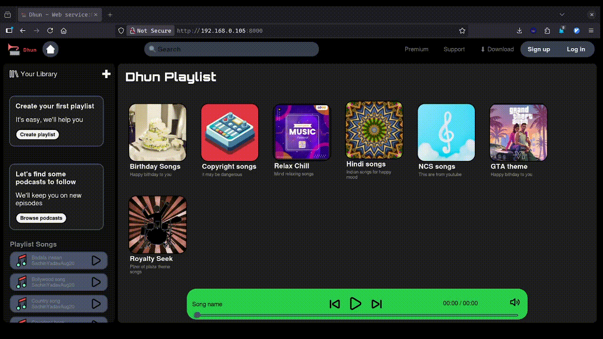
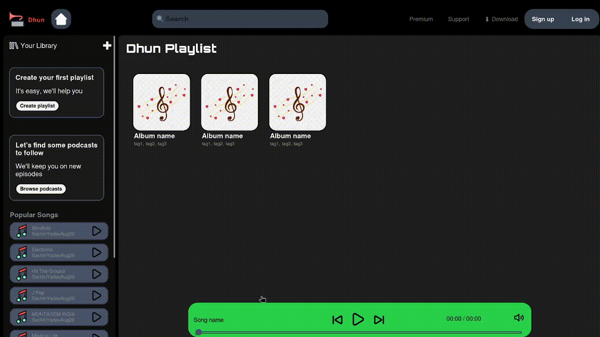
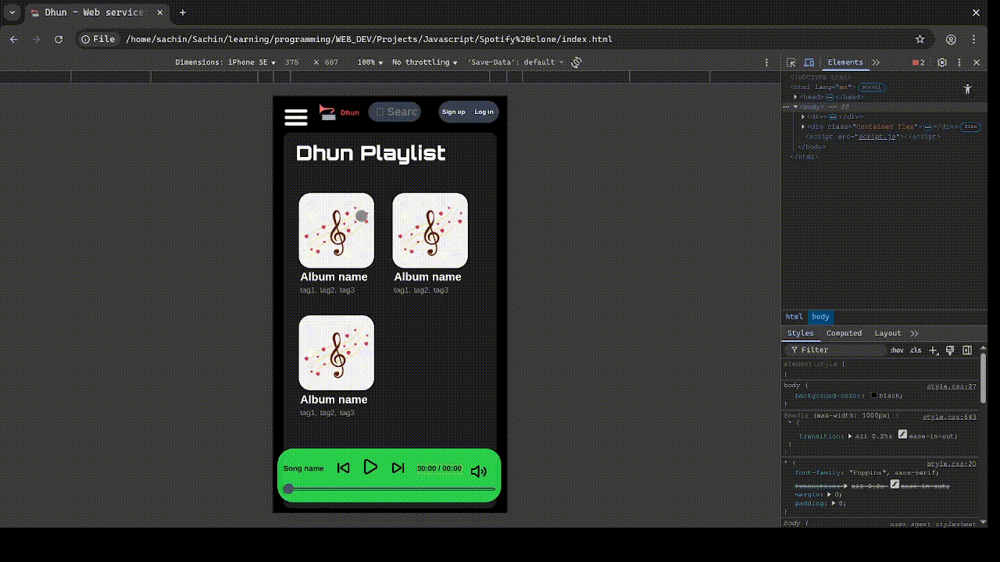
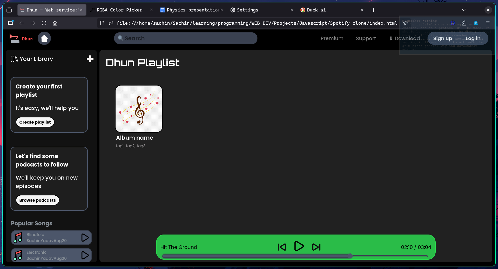
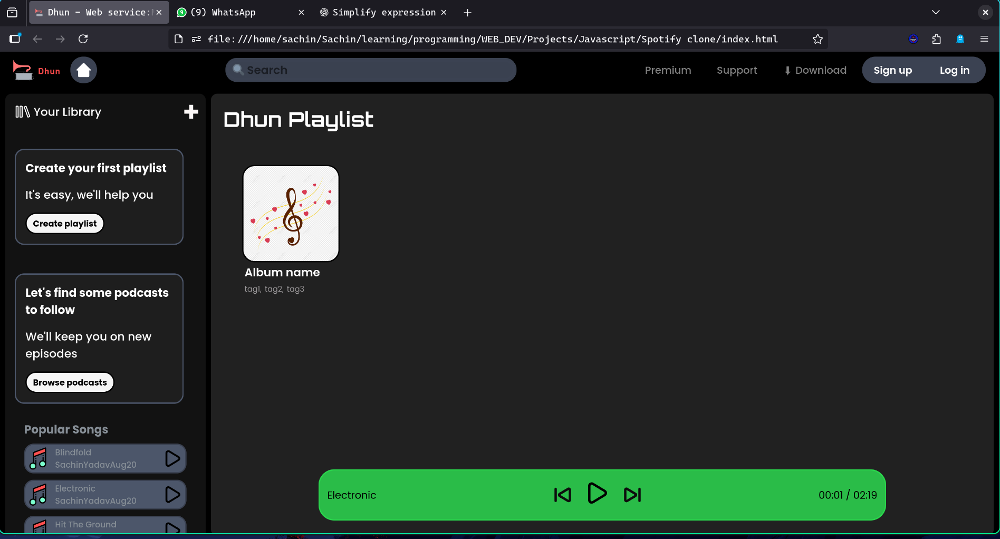
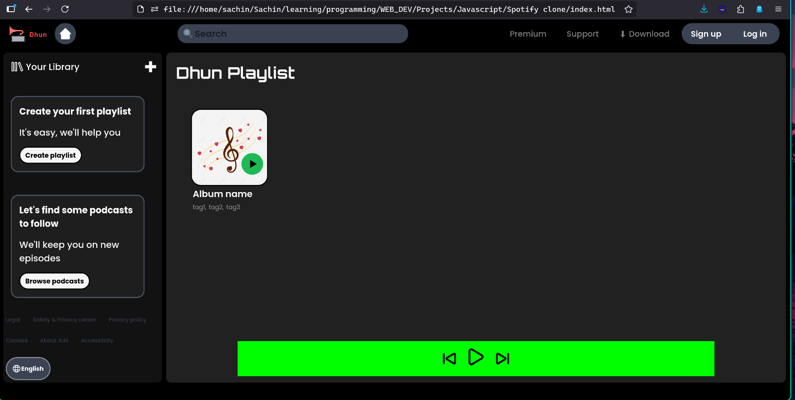

# Dhun – Web Music Player 🎵

# Dhun – Web Music Player 🎵

Dhun is a lightweight **Spotify-style** web music player built using only **HTML, CSS, and JavaScript** — no backend frameworks!  
It dynamically loads playlists from a local directory and gives you a clean and smooth listening experience.

---

## 🚀 Features

✅ Auto-sync playlists with your system files  
✅ Add unlimited playlists by simply creating folders inside `/songs/`  
✅ Reads playlist details from `info.json` *(title, description, cover image)*  
✅ Music playback with play/pause, next/prev controls  
✅ Seek bar + Volume control with dynamic UI  
✅ Mobile-friendly responsive layout  
✅ Clean dark UI inspired by Spotify  
✅ Click-based playlist browsing  
✅ Works over LAN Web Server *(Python Simple Server tested)*

---

## 🎶 How to Use Dhun

Dhun is a lightweight music player that organizes your songs into folders and playlists automatically.  
Just drop your music inside the **/songs/** directory with a simple structure, and Dhun will do the rest.

---

### 📁 Folder Structure

songs/
├── playlist1/
│ ├── track1.mp3
│ ├── track2.mp3
│ └── info.json
├── playlist2/
│ ├── another_song.mp3
│ └── info.json
...

Each playlist folder must contain:

- ✅ MP3 audio files  
- ✅ `info.json` with playlist details  

Example `info.json`:
```json
{
  "title": "NCS Hits",
  "discription": "Best No Copyright Music!"
}
🎧 Play Music

Open Dhun in your browser

Click any Song Card to open that playlist

Select a song to start playback

Use the bottom player controls to:

⏯️ Play / Pause

⏭️ Next Song

⏮️ Previous Song

🔉 Adjust Volume

🔁 Loop toggle


# Screenshot
Here’s a preview of the current state (as of 25-10-2025):



as of 24-10-2025:



as of 23-10-2025:



as of 22-10-2025:



as of 21-10-2025:



as of 20-10-2025:



